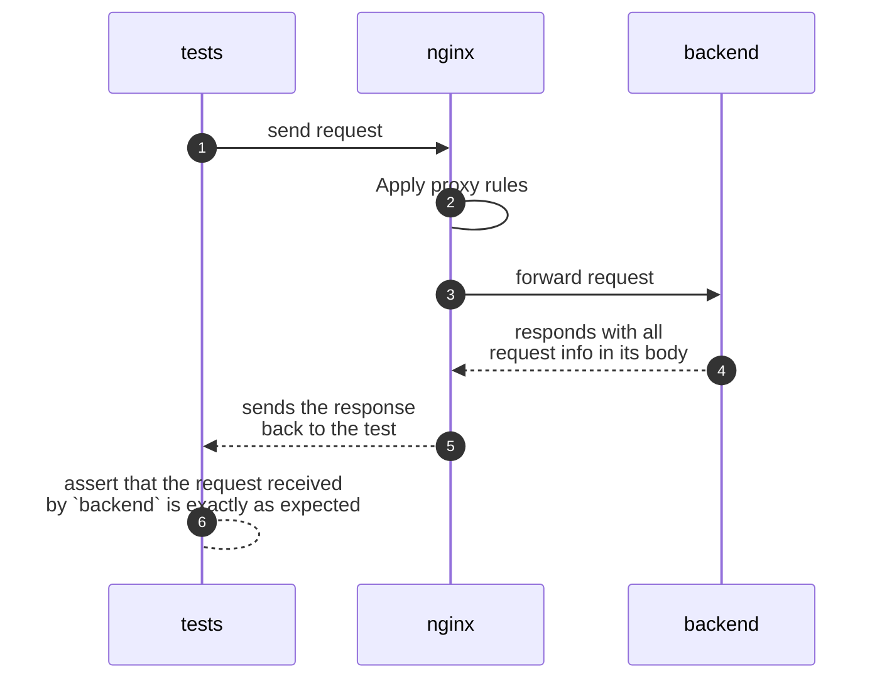

# Example proxy test setup

You can run it with:

```bash
docker compose up --build --attach tests
```

Here's the architecture:


`tests` is any test project setup you desire. I've implemented one in the `tests` folder.

`proxy` is the proxy server you want to test. Ideally, you'll be able to test it in a functional manner, without having to tweak its configuration to test it.

`backend` and `any_domain` are two services mocked using `mirror-server`. Their job is just to put everything they get in the response for `tests` be able to assert that the proxy rules set on `proxy` are working exactly as intended.

Here's the sequence flow:



There's a few nice details too:

- `any_domain` is accessed using `https://any_domain.com` in the `proxy` code. To make it work, I needed to:
  - In `docker-compose.yml`:
    - Set the `SERVER_PORT_HTTPS` env var to 443 to accept the traffic in the default HTTPS port
    - Set `any_domain.com` as an alias for the `any_domain` service inside the network created by `docker compose`
- The same could be done using HTTP, or using any other host besides `any_domain.com`
- You could implement the tests in any language your team prefers. You just have to send requests to the proxy service you defined in your `docker-compose.yml`
- Feel free to launch a `mirror-server` for each upstream server you need to proxy to. It's meant for fast startup and small memory footprint. You can always use only one `mirror-server` too. That's all up to you and your technical needs.
- There's a [script that waits for the proxy be up](./tests/wait-upstream.sh). Otherwise, tests could receive a `connection refused` error if they started before the proxy did.
